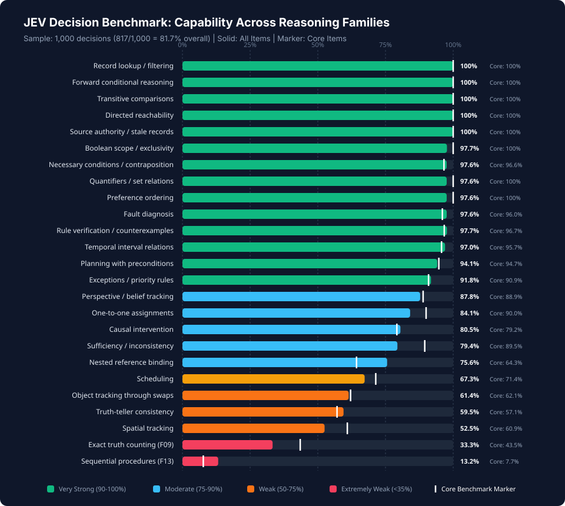
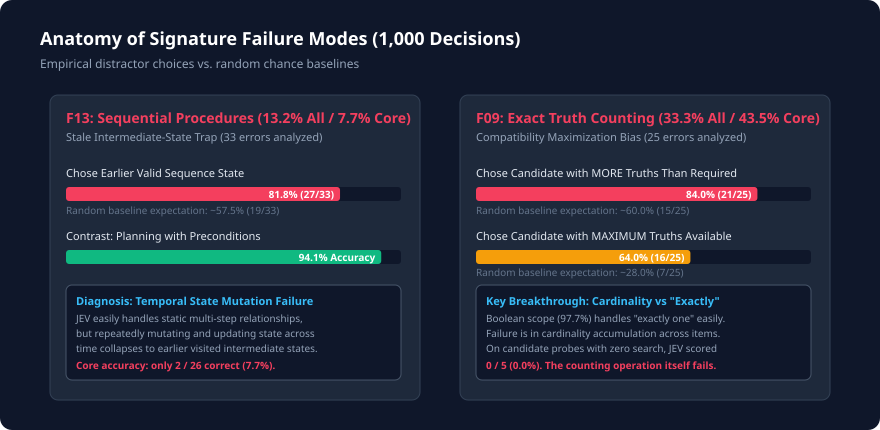

# JEV Deterministic Decision Benchmark (`JEV-DD-1.0`)
### 1,000-Decision Evaluation Report, Behavioral Fingerprint & System Design Guide

[](https://etsabary.github.io/jev-deterministic-benchmark/)
[](#)
[-purple.svg)](#)
[](#)
[-emerald.svg)](#)

> 🌐 **Explore the Live Interactive Visualization Dashboard:**  
> 👉 **[https://etsabary.github.io/jev-deterministic-benchmark/](https://etsabary.github.io/jev-deterministic-benchmark/)**

---

## ⚡ The Decision Engineer's Cheat Sheet (Read This First)

If you are designing decision-making pipelines or agentic workflows with **JEV (`jev-latest` / `jev-1.13.0`)**, here is the immediate operational rulebook derived from 1,000 benchmark decisions:

| Workflow Pattern | Operational Verdict | Observed Performance | System Design Recommendation |
| :--- | :---: | :---: | :--- |
| **Static Relational Logic** <br>*(Conditionals, Contraposition, Quantifiers, Boolean Scope, Directed Reachability, Source Authority)* | 🟢 **GREEN LIGHT** | **97% – 100%** <br>*(Flawless)* | **Safe for direct, autonomous execution.** JEV excels at evaluating static candidate states against declarative rules and constraints. |
| **High-Confidence Autonomous Gate** <br>*(Decisions with reported confidence $\ge 0.95$)* | 🟢 **GREEN LIGHT** | **99.8%** <br>*(492 / 493 correct)* | **Use confidence as an execution gate.** Half of all queries (49.3%) trigger $\ge 0.95$. Allow these to run unreviewed; route $< 0.90$ to verification. |
| **Constraint Satisfaction & Search** <br>*(Scheduling, One-to-One Assignments, Sufficiency, Causal Interventions)* | 🟡 **YELLOW LIGHT** | **65% – 90%** <br>*(Moderate)* | **Use programmatic verification.** JEV solves these moderately well, but reliability degrades as simultaneous constraints multiply. |
| **Sequential State Transformation** <br>*(Tracking cards/tokens through a series of ordered swaps or mutations)* | 🔴 **RED LIGHT** | **13.2% All** <br>**7.7% Core** | **DO NOT use JEV as a serial state machine.** JEV gets trapped in intermediate states (**81.8% of errors**). Offload step-by-step state propagation to Python/code. |
| **Exact Cardinality Counting** <br>*(Puzzles requiring "satisfy exactly $N$ true conditions")* | 🔴 **RED LIGHT** | **33.3% All** <br>**43.5% Core** | **DO NOT rely on JEV for exact counts.** JEV acts as a *compatibility maximizer* (**84% of errors** choose options with *more* truths than required). Use symbolic counters. |
| **Indirect Exclusion Chains** <br>*(Deducing an entity's state when it has no direct clues)* | 🔴 **RED LIGHT** | **Systematic Blindspot** | If Entity $X$ has no direct rule and depends on indirect elimination across others, JEV frequently defaults to "more than one is possible" (even at 0.95 confidence). |

---

## 📊 Benchmark Results at a Glance

### 1. Capability Profile Across 25 Reasoning Families (All vs. Core)


---

### 2. Operational Confidence Calibration & "Act vs. Escalate" Curve


---

### 3. Anatomy of Signature Failure Modes (F09 & F13)


---

## 🔬 In-Depth Capability Breakdown

| Ability / Reasoning Family | All Accuracy | Core Accuracy | Behavioral Classification |
| :--- | :---: | :---: | :--- |
| **Record lookup / filtering** | **100.0%** | **100.0%** | Very Strong (Static Relational) |
| **Forward conditional reasoning** | **100.0%** | **100.0%** | Very Strong (Static Relational) |
| **Transitive comparisons** | **100.0%** | **100.0%** | Very Strong (Static Relational) |
| **Directed reachability** | **100.0%** | **100.0%** | Very Strong (Static Relational) |
| **Source authority / stale records** | **100.0%** | **100.0%** | Very Strong (Static Relational) |
| **Boolean scope / exclusivity** | **97.7%** (43/44) | **100.0%** | Very Strong (Static Relational) |
| **Necessary conditions / contraposition** | **97.6%** | **96.6%** | Very Strong (Static Relational) |
| **Quantifiers / set relations** | **97.6%** | **100.0%** | Very Strong (Static Relational) |
| **Preference ordering** | **97.6%** | **100.0%** | Very Strong (Static Relational) |
| **Fault diagnosis** | **97.6%** | **96.0%** | Very Strong (Static Relational) |
| **Rule verification / counterexamples** | **97.7%** | **96.7%** | Very Strong (Static Relational) |
| **Temporal interval relations** | **97.0%** | **95.7%** | Very Strong (Static Relational) |
| **Planning with preconditions** | **94.1%** | **94.7%** | Very Strong (Preconditions) |
| **Exceptions / priority rules** | **91.8%** | **90.9%** | Very Strong (Static Relational) |
| **Perspective / belief tracking** | **87.8%** | **88.9%** | Moderate (Constraint) |
| **One-to-one assignments** | **84.1%** | **90.0%** | Moderate (Constraint) |
| **Causal intervention** | **80.5%** | **79.2%** | Moderate (Constraint) |
| **Sufficiency / inconsistency** | **79.4%** | **89.5%** | Moderate (Constraint) |
| **Nested reference binding** | **75.6%** | **64.3%** | Moderate (Constraint) |
| **Scheduling** | **67.3%** | **71.4%** | Moderate (Constraint) |
| **Object tracking through swaps** | **61.4%** | **62.1%** | Weak (State Tracking) |
| **Truth-teller consistency** | **59.5%** | **57.1%** | Weak (Global Constraint) |
| **Spatial tracking** | **52.5%** | **60.9%** | Weak (Spatial Updating) |
| **Exact truth counting (F09)** | **33.3%** (15/45) | **43.5%** | **Extremely Weak (Cardinality)** |
| **Sequential procedure execution (F13)** | **13.2%** (5/38) | **7.7%** (2/26) | **Extremely Weak (State Mutation)** |

---

## 🎯 Concrete Failure Case Studies (What Fails & Why)

### Case 1: Sequential Procedure Execution (`J001646`)
* **Family**: `F13` (Sequential Procedures)
* **Underlying Failure Mechanism**: **Stale Intermediate-State Attractor Trap**. JEV performs initial transformations but leaks an uncompleted intermediate state into its final readout.

> **Context:** Five name cards start in this left-to-right order: `Pia, Noel, Zane, Gus, Quin`. Carry out the numbered steps in numerical order. Positions always refer to the current order, not the initial order.
> 
> * Step 1: Reverse the whole left-to-right order.
> * Step 2: Reverse the whole left-to-right order.
> * Step 3: Reverse the whole left-to-right order.
> * Step 4: Move the last card to the first position, keeping the order of the others.
> * Step 5: Move the last card to the first position, keeping the order of the others.
> * Step 6: Swap the first and last cards; leave the others in place.
> 
> **Question:** Which name is in the fifth position at the end?  
> Options: `(1) Zane`, `(2) Pia`, `(3) Quin`, `(4) Gus`, `(5) Noel`

#### Execution Trace:
1. **Initial**: `[Pia, Noel, Zane, Gus, Quin]`
2. **Step 1 (Reverse)**: `[Quin, Gus, Zane, Noel, Pia]`
3. **Step 2 (Reverse)**: `[Pia, Noel, Zane, Gus, Quin]`
4. **Step 3 (Reverse)**: `[Quin, Gus, Zane, Noel, Pia]` $\to$ *(Notice: Pia is at position 5 here!)*
5. **Step 4 (Last to First)**: `[Pia, Quin, Gus, Zane, Noel]`
6. **Step 5 (Last to First)**: `[Noel, Pia, Quin, Gus, Zane]`
7. **Step 6 (Swap First & Last)**: `[Zane, Pia, Quin, Gus, Noel]` $\to$ **Correct Answer is Noel (Option 5)**.

* **Gold Option**: **Option 5 (Noel)**
* **JEV's Selection**: **Option 2 (Pia)**
* **Diagnostic Finding**: JEV selected **Pia**, which occupied the queried fifth position **at Step 3**. Across 33 sequential procedure errors, **81.8% (27/33)** chose an object that genuinely occupied the queried slot at an earlier point in the sequence.

---

### Case 2: Exact Truth Counting (`J001161`)
* **Family**: `F09` (Exact Truth Counting)
* **Underlying Failure Mechanism**: **Compatibility Maximizer Bias**. JEV treats the prompt as *"find the candidate that satisfies the most evidence"* rather than enforcing the hard equality constraint *"satisfies exactly 3"*.

> **Context:** A prize is in exactly one of five chests: `Hazel, Pine, Cedar, Oak and Laurel`. Exactly three of the numbered inscriptions below are true.
> 
> * Inscription 1: The prize is not in the Pine chest.
> * Inscription 2: The prize is in neither the Pine chest nor the Cedar chest.
> * Inscription 3: The prize is in the Laurel chest.
> * Inscription 4: The prize is in the Hazel chest or the Pine chest.
> * Inscription 5: The prize is in neither the Cedar chest nor the Laurel chest.
> * Inscription 6: The prize is in neither the Hazel chest nor the Pine chest.
> * Inscription 7: The prize is in neither the Hazel chest nor the Oak chest.
> * Inscription 8: The prize is not in the Cedar chest.
> 
> **Question:** Which chest contains the prize?  
> Options: `(1) Oak chest`, `(2) Cedar chest`, `(3) Laurel chest`, `(4) Hazel chest`, `(5) Pine chest`

#### Truth-Value Evaluation:
* If the prize is in **Cedar (Gold Answer, Option 2)**:
  - Inscriptions 1, 6, 7 are **True** (Total = **exactly 3**).
* If the prize is in **Oak (JEV's Choice, Option 1)**:
  - Inscriptions 1, 2, 5, 6, 8 are **True** (Total = **5 true statements**).

* **Gold Option**: **Option 2 (Cedar chest)**
* **JEV's Selection**: **Option 1 (Oak chest)** with **0.57 confidence**.
* **Diagnostic Finding**: Oak violates the rule by having **5 true statements** instead of 3. Yet JEV chose Oak because it produced the **maximum number of true statements**. Across all 25 analyzed F09 errors, **84.0% (21/25)** chose candidates with *more* true statements than required, and **64.0% (16/25)** chose the candidate with the *maximum* possible true statements.

---

### Case 3: Candidate Probe Proof (`J000868`)
* **Family**: `Candidate Probes` (Cardinality / Evaluation without search)
* **Underlying Failure Mechanism**: **Enumeration Breakdown Inside a Supplied State**. Proves that failures are not caused by search space exhaustion.

> **Context:** Wren, Ava, Ravi, Ben and Dion each give one presentation on Monday through Friday.
> * Clue 1: Ava does not present on Tuesday.
> * Clue 2: Ben presents earlier in the week than Ravi.
> * Clue 3: Ben presents on the day immediately after Ava.
> * Clue 4: Ravi presents on the day immediately after Wren.
> * Clue 5: Dion presents earlier in the week than Wren.
> 
> **Question:** A proposed full schedule is `Monday: Ava; Tuesday: Ben; Wednesday: Ravi; Thursday: Dion; Friday: Wren`. How many of the numbered clues does this proposed schedule violate? Count each clue once.  
> Options: `(1) One`, `(2) Two`, `(3) Zero`, `(4) Four`, `(5) Three`

#### Clue Check on the Supplied Schedule:
* Clue 1 (Ava not Tue): Monday $\to$ **Satisfied**
* Clue 2 (Ben before Ravi): Tue before Wed $\to$ **Satisfied**
* Clue 3 (Ben after Ava): Tue after Mon $\to$ **Satisfied**
* Clue 4 (Ravi after Wren): Wed after Fri $\to$ **VIOLATED**
* Clue 5 (Dion before Wren): Thu before Fri $\to$ **Satisfied**
* Total Violated Clues = **Exactly 1**.

* **Gold Option**: **Option 1 (One)**
* **JEV's Selection**: **Option 2 (Two)** with **0.90 confidence**!
* **Diagnostic Finding**: The candidate world was already supplied—no combinatorial search was required. JEV still miscounted the violations, proving the failure is in the **cardinality accumulation operation itself**.

---

### Case 4: Spatial Movement Reversal (`J001860`)
* **Family**: `Spatial Tracking`
* **Underlying Failure Mechanism**: **Primitive Operation Semantic Reversal**. Confusing backward movement with movement in the facing direction.

> **Context:** A robot named Jia starts at a marked point facing East. A turn changes only its facing direction. Moving forward or backward moves it one block without changing its facing direction.
> * Command 1: Turn a quarter-turn to the right. (Now facing South)
> * Command 2: Move backward one block. (Moves North)
> * Command 3: Move backward one block. (Moves North)
> * Command 4: Move forward one block. (Moves South)
> 
> **Question:** Where is the robot relative to its starting point?  
> Options: `(1) Starting point`, `(2) Directly south`, `(3) Directly north`, `(4) Directly west`, `(5) Directly east`

* **Gold Option**: **Option 3 (Directly north)** (Net displacement: +1 block North)
* **JEV's Selection**: **Option 2 (Directly south)** with **0.92 confidence**.
* **Diagnostic Finding**: Because the robot faced South, JEV treated "backward" as displacement South, failing to execute the primitive coordinate negation.

---

### Case 5: Spatial Orientation Trap (`J001892`)
* **Family**: `Spatial Tracking`
* **Underlying Failure Mechanism**: **Orientation vs. Displacement Confusion & Early State Anchoring**.

> **Context:** A robot named Dion starts facing North.
> * Command 1: Turn a quarter-turn to the left. (Faces West)
> * Command 2: Turn a quarter-turn to the left. (Faces South)
> * Command 3: Move forward one block. (Displacement: 1 block South)
> * Command 4: Move forward one block. (Displacement: 2 blocks South)
> * Command 5: Turn a quarter-turn to the left. (Faces East)
> * Command 6: Turn a quarter-turn to the right. (Faces South)
> 
> **Question:** Where is the robot relative to its starting point?  
> Options: `(1) At starting point`, `(2) Directly west`, `(3) Directly east`, `(4) Directly north`, `(5) Directly south`

* **Gold Option**: **Option 5 (Directly south)**
* **JEV's Selection**: **Option 2 (Directly west)** with **0.91 confidence**.
* **Diagnostic Finding**: JEV chose **West**—which was the robot's heading after the very first turn. It confused an intermediate orientation with the final spatial displacement.

---

### Case 6: Indirect Exclusion Chain (`J001325`)
* **Family**: `One-to-One Assignments`
* **Underlying Failure Mechanism**: **Failure to Close Indirect Exclusion Chains**. Unable to deduce uniqueness when the queried entity has no direct clues.

> **Context:** Cara, Wren and Faye each use exactly one locker: `Elm, Oak and Fern`. Each locker is used by exactly one person.
> * Clue 1: Cara uses the Fern locker.
> * Clue 2: Faye does not use the Elm locker.
> 
> **Question:** Which answer correctly describes Wren's locker assignment?  
> Options: `(1) Only Oak`, `(2) Only Fern`, `(3) Only Elm`, `(4) No assignment satisfies clues`, `(5) More than one locker remains possible`

#### Deduction:
1. Cara = Fern (Clue 1). Remaining lockers: Elm, Oak. Remaining people: Faye, Wren.
2. Faye $\neq$ Elm (Clue 2) $\implies$ Faye = Oak.
3. Therefore, Wren = Elm (**Uniquely determined**).

* **Gold Option**: **Option 3 (Only the Elm locker)**
* **JEV's Selection**: **Option 5 (More than one locker remains possible)** with **0.95 confidence**!
* **Forensic Robustness Check**: Across 4 variations of this exact puzzle (long noise, expanded options, 2 option rotations), JEV chose the **exact same semantic wrong answer** every time. When a controlled contrast edit altered the clues so that multiple lockers really *were* possible, JEV chose it correctly with 0.98 confidence.
* **Diagnostic Finding**: JEV exhibits a structural blind spot when deriving uniqueness through indirect exclusion chains without a direct sentence mentioning the queried entity.

---

## ⚖️ Positional Balance & Semantic Invariance


* **Option Selection Uniformity**:  
  Across 1,000 decisions, choices are virtually uniform across all 5 slots (expected = 20.0% / 200 items):
  * Option 1: **206 (20.6%)**
  * Option 2: **201 (20.1%)**
  * Option 3: **188 (18.8%)**
  * Option 4: **198 (19.8%)**
  * Option 5: **207 (20.7%)**
* **Semantic Invariance**:  
  Across 94 pairs where option positions were rotated, JEV chose the **same underlying semantic meaning 92.6% of the time**, and **100% (15/15)** on identical problem clones, confirming that decisions reflect genuine semantic evaluation rather than positional artifacts.

---

## 📦 Repository Structure & Data Access

```text
├── README.md                           # This report & design guide
├── DIAGNOSTIC_ANALYSIS.md              # Living cumulative diagnostic analysis log
├── run_benchmark.py                    # Multi-channel benchmark runner (TypeSafe, OpenRouter, Experiential)
├── test_offline.py                     # Offline test suite (7 tests, 0.22s)
├── docs/
│   └── index.html                      # Interactive Generative UI Dashboard (GitHub Pages)
├── charts/                             # Standalone publication-quality vector SVG charts
│   ├── reasoning_families_accuracy.svg # 25 families: All vs Core performance
│   ├── confidence_calibration.svg      # Confidence calibration & selectivity curve
│   ├── failure_modes_f09_f13.svg       # Distractor analysis for F09 & F13 vs random chance
│   └── option_distribution_balance.svg # Positional selection uniformity
├── data/
│   ├── results_1000_eval.csv           # Raw 1,000-decision evaluation results (CSV)
│   └── questions_1000.csv              # Question texts, criteria, and contexts (CSV)
└── .gitignore                          # Protects .env, keys, and private answer keys
```

---

## 🚀 How to Reproduce

```bash
# 1. Run automated offline test suite
python3 test_offline.py

# 2. Dry-run smoke test (no credits spent)
python3 run_benchmark.py --plan smoke

# 3. Live multi-channel execution
python3 run_benchmark.py --plan evaluation --batch-size 400 --execute
```

---

## 🔒 License & Data Integrity Notice
To prevent pre-training benchmark contamination, private answer keys (`*_PRIVATE.csv`) are omitted from public releases. Results, question texts, and evaluation harnesses are open for academic and evaluation use.
